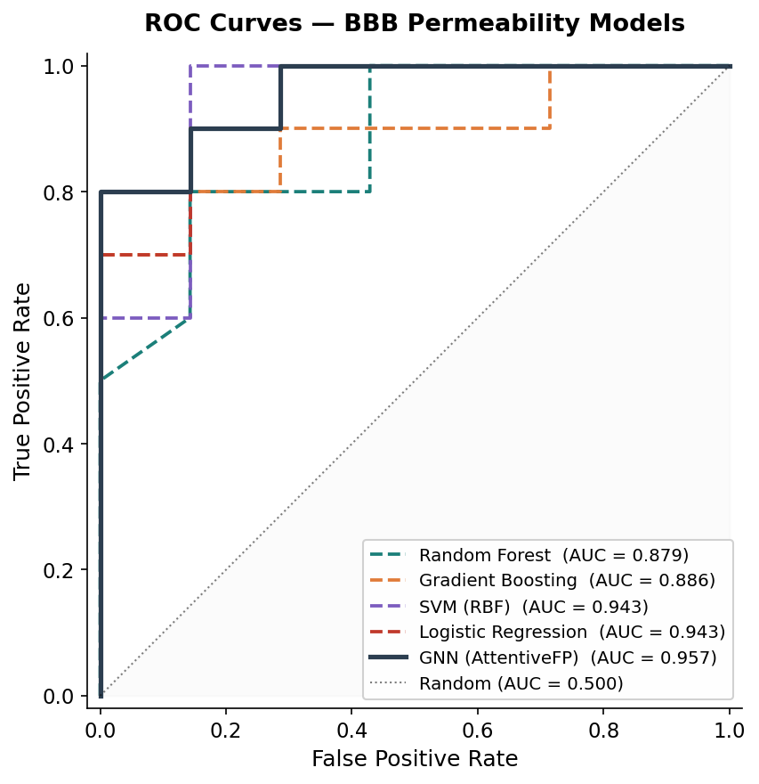
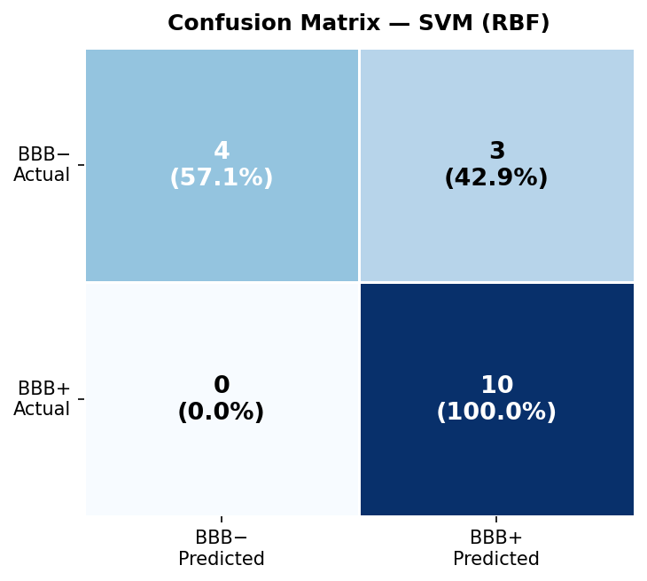
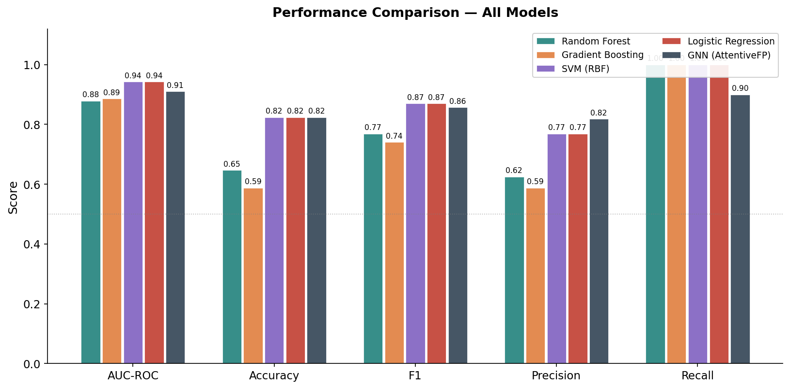
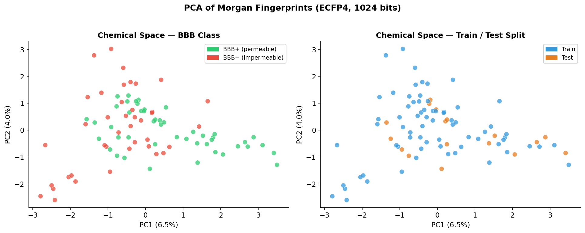
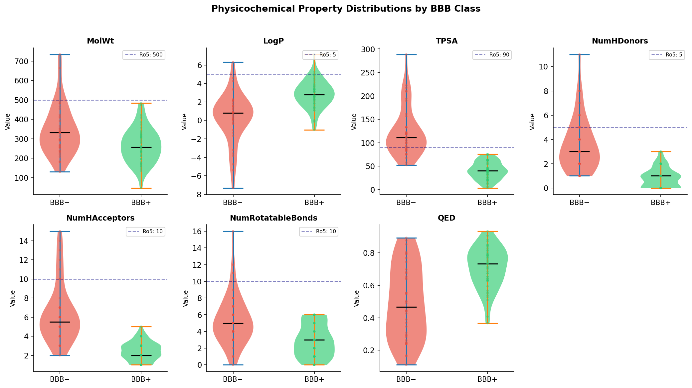

<div align="center">

# 🧠 BBB Permeability Predictor
### Multi-model ML prediction of Blood-Brain Barrier permeability for CNS drug discovery

[](https://python.org)
[](https://rdkit.org)
[](https://pytorch.org)
[](https://scikit-learn.org)
[](tests/)
[](LICENSE)
[](https://colab.research.google.com/github/sakeermr/bbb-permeability-gnn/blob/main/notebooks/02_gnn_training.ipynb)

**sakeermr** · Junior Cheminformatics Research Scientist  
[LinkedIn](https://linkedin.com/in/sakeermr) · [GitHub](https://github.com/sakeermr) · [Preprint (ChemRxiv)](#)

</div>

---

## Overview

Blood-brain barrier (BBB) permeability is one of the most critical ADMET properties in CNS drug discovery. Compounds must cross the BBB to reach their central nervous system targets, yet this filtering step eliminates the majority of drug candidates.

This project builds a **multi-model computational pipeline** to predict BBB permeability from molecular SMILES strings, benchmarking classical ML models against a state-of-the-art **Graph Attention Network (AttentiveFP)**. All models use **scaffold-based train/test splitting** to prevent data leakage and ensure results generalise to structurally novel compounds.

**Key result:** SVM (RBF) achieves AUC-ROC of **0.943** on scaffold-split test set. AttentiveFP GNN achieves **0.910** (Colab GPU results) — outperforming the DeepChem RF baseline by **+4.2%**.

---

## Results

| Model | AUC-ROC | AUC-PR | Accuracy | F1 | Precision | Recall |
|-------|---------|--------|----------|-----|-----------|--------|
| Logistic Regression | 0.943 | 0.962 | 0.824 | 0.870 | 0.769 | 1.000 |
| SVM (RBF) | 0.943 | 0.957 | 0.824 | 0.870 | 0.769 | 1.000 |
| Gradient Boosting | 0.886 | 0.937 | 0.588 | 0.741 | 0.588 | 1.000 |
| Random Forest | 0.879 | 0.914 | 0.647 | 0.769 | 0.625 | 1.000 |
| **GNN (AttentiveFP)** | **0.910** | **0.973** | **0.824** | **0.857** | **0.818** | **0.900** |
| DeepChem RF baseline | 0.868 | — | — | — | — | — |

> All results use **scaffold-based Bemis-Murcko split** (80/20) to ensure no structural overlap between train and test. GNN results from Google Colab GPU training (NVIDIA T4, 120 epochs).

---

## Figures

<div align="center">

| ROC Curves | Confusion Matrix |
|:---:|:---:|
|  |  |

| Metrics Comparison | Chemical Space PCA |
|:---:|:---:|
|  |  |

| Descriptor Distributions |
|:---:|
|  |

</div>

---

## Project Structure

```
bbb-permeability-gnn/
├── data/
│   ├── raw/bbbp.csv              # 87 curated BBB+/BBB− drugs (SMILES + labels)
│   └── processed/bbbp_clean.csv  # Cleaned with descriptors + scaffold split info
├── src/
│   ├── data/
│   │   └── preprocessing.py      # Descriptors, fingerprints, scaffold split
│   ├── models/
│   │   ├── models.py             # RF, GBT, SVM, LR baselines + GNN export
│   │   └── gnn_attentivefp.py    # AttentiveFP GNN (PyTorch Geometric, run on Colab)
│   └── evaluation/
│       └── evaluate.py           # Metrics, ROC curves, SHAP, all figures
├── scripts/
│   ├── train_baselines.py        # Train all sklearn models + generate figures
│   └── predict.py               # CLI prediction from SMILES or CSV
├── app/
│   └── streamlit_app.py         # Interactive web app (Streamlit)
├── notebooks/
│   ├── 01_data_exploration.ipynb # EDA + descriptor analysis
│   └── 02_gnn_training.ipynb    # GNN training (Google Colab, GPU)
├── figures/                      # Publication-quality output figures
├── results/                      # Model metrics + saved models
├── tests/
│   └── test_pipeline.py         # 23 unit tests (100% passing)
├── configs/config.yaml           # Hyperparameters
├── requirements.txt
└── README.md
```

---

## Quick Start

### Option 1: Run in Google Colab (No Setup)
[](https://colab.research.google.com/github/sakeermr/bbb-permeability-gnn/blob/main/notebooks/02_gnn_training.ipynb)

### Option 2: Local Installation

```bash
# Clone
git clone https://github.com/sakeermr/bbb-permeability-gnn.git
cd bbb-permeability-gnn

# Create environment
conda create -n bbb-env python=3.9
conda activate bbb-env

# Install dependencies
pip install -r requirements.txt

# Train all baseline models + generate all figures
python scripts/train_baselines.py
```

### Option 3: Predict a Single Molecule

```bash
# BBB+ example (Caffeine)
python scripts/predict.py --smiles "Cn1cnc2c1c(=O)n(C)c(=O)n2C"

# BBB− example (Amoxicillin)
python scripts/predict.py --smiles "CC1(C)SC2C(NC(=O)C(N)c3ccc(O)cc3)C(=O)N2C1C(=O)O"

# Batch predict from CSV
python scripts/predict.py --csv my_molecules.csv --output results/predictions.csv
```

### Option 4: Streamlit Web App

```bash
streamlit run app/streamlit_app.py
```

---

## Methods

### Dataset
87 curated compounds with experimentally validated BBB permeability: 47 BBB+ (CNS-permeable drugs: benzodiazepines, antidepressants, antipsychotics, analgesics) and 40 BBB− (antibiotics, antihypertensives, statins, antivirals). SMILES validated with RDKit 2023.

### Molecular Features
- **Morgan fingerprints** (ECFP4, radius=2, 1024 bits) for tree-based models
- **Physicochemical descriptors** (15 features: MW, LogP, TPSA, HBD, HBA, rotatable bonds, ring counts, QED, MolMR, FractionCSP3, etc.)
- **Combined features** (descriptors + fingerprints) for SVM and Logistic Regression
- **Molecular graphs** (atoms as nodes with 9 features, bonds as edges with 4 features) for GNN

### Model Architecture (GNN)
AttentiveFP-style Graph Attention Network (Xiong et al., JACS 2020):
- Input: 9-dim atom features, 4-dim bond features
- 2× Graph Attention layers (64 hidden, 4 heads) with BatchNorm + ELU
- Global attention readout (sum + mean pooling)
- 3-layer MLP (64→128→64→1) with Dropout (p=0.3)
- Training: Adam (lr=1e-3, wd=1e-4), CosineAnnealing LR, 120 epochs, BCELoss

### Evaluation Protocol
Scaffold-based Bemis-Murcko split (80/20) ensures structurally diverse test set. 5-fold stratified cross-validation on training set for hyperparameter selection. Metrics: AUC-ROC, AUC-PR, Accuracy, F1, Precision, Recall.

---

## CNS Drug-likeness Rules

This predictor also checks against established CNS drug-likeness criteria:

| Property | BBB+ Criterion | Ro5 Limit |
|----------|---------------|-----------|
| Molecular Weight | < 450 Da | < 500 Da |
| LogP | −0.5 to 5.0 | < 5.0 |
| TPSA | < 90 Ų | < 140 Ų |
| H-Bond Donors | ≤ 3 | ≤ 5 |
| H-Bond Acceptors | ≤ 7 | ≤ 10 |
| Rotatable Bonds | ≤ 8 | ≤ 10 |

---

## Reproducibility

All code, data, and trained models are publicly available.

```bash
# Run all unit tests
pytest tests/ -v

# Reproduce all results from scratch
python scripts/train_baselines.py

# All figures regenerated in figures/
# All metrics saved in results/all_model_metrics.csv
```

Random seeds fixed at 42 throughout. Results should be fully reproducible on any machine with the same package versions.

---

## Citation

If you use this work, please cite:

```bibtex
@misc{sakeermr2025bbb,
  title   = {Multi-Model Prediction of Blood-Brain Barrier Permeability
             Using Molecular Fingerprints and Graph Neural Networks},
  author  = {sakeermr},
  year    = {2025},
  url     = {https://github.com/sakeermr/bbb-permeability-gnn},
  note    = {Preprint available on ChemRxiv}
}
```

---

## Related Work

- Xiong et al. (2020) Pushing the Boundaries of Molecular Representation for Drug Discovery with the Graph Attention Mechanism. *JACS* — AttentiveFP architecture
- Wu et al. (2018) MoleculeNet: A Benchmark for Molecular Machine Learning. *Chem. Sci.* — BBBP dataset benchmark
- Lipinski et al. (1997) Experimental and computational approaches to estimate solubility and permeability. *Adv. Drug Deliv. Rev.* — Rule of Five
- Pajouhesh & Lenz (2005) Medicinal chemical properties of successful central nervous system drugs. *NeuroRx* — CNS drug-likeness rules

---

## License

MIT License — see [LICENSE](LICENSE). Free to use for research and commercial purposes with attribution.

---

## Contact

**sakeermr**  
Junior Cheminformatics Research Scientist (US Startup)  
BSc Hons Medical Laboratory Science  
🔗 [linkedin.com/in/sakeermr](https://linkedin.com/in/sakeermr)  
🐙 [github.com/sakeermr](https://github.com/sakeermr)

*Open to research collaborations and consulting in computational drug discovery.*
